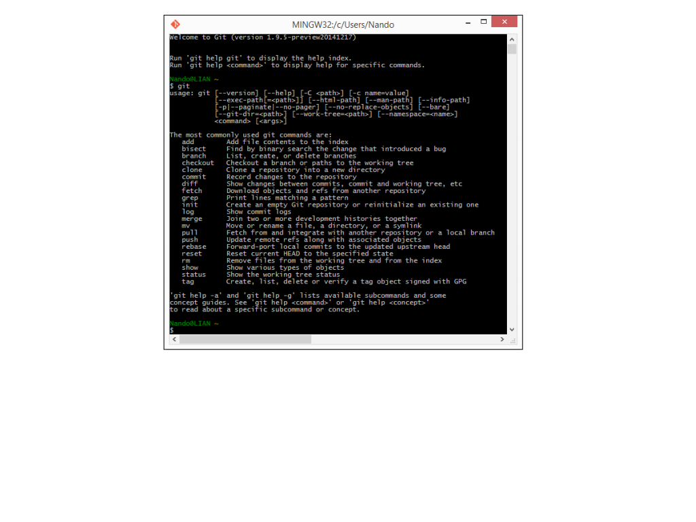

# Teaching-Git-BASICS-

###### INTRODUCTION

#### FIRST STEP

  Install Git 
  
 * If you are windows user you can download it 
 
  here [Git For Windows](http://git-scm.com)

 * For Mac User Download Git 

  here [Git For Mac](http://git-scm.com/downloads)

#### Running our first Git command

* Open command prompt 
* Type git only
* will result in a short help page with a list of common commands.

* If this command show nothing then try to reinstall Git again